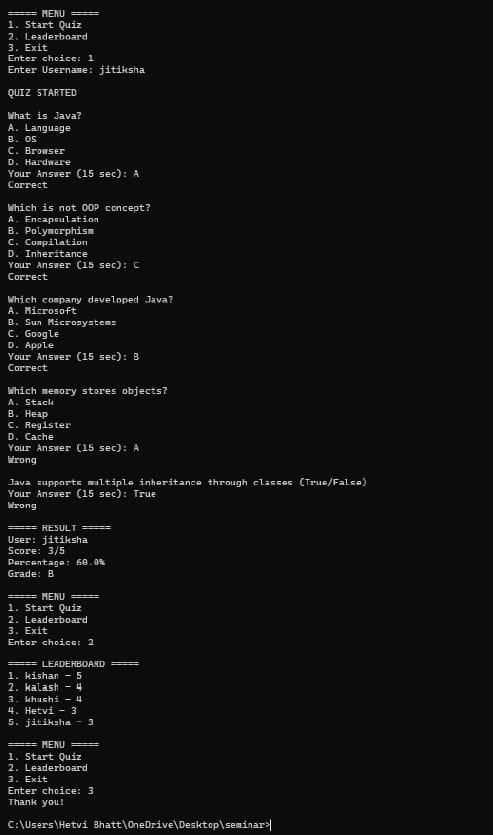

# Java-Mini-Project
Java-Mini-Project-12402080601059
# Java Quiz Application

## Project Description

The **Java Quiz Application** is a console-based interactive quiz system built with Java. It allows users to attempt a timed quiz consisting of Multiple Choice Questions (MCQ) and True/False questions, receive instant feedback, view their score and grade, and compete on a leaderboard. Results are saved persistently to a file (`results.txt`), making it suitable for classroom or seminar use.

**Key Features:**
- Multiple question types: MCQ and True/False
- 15-second timer per question
- Automatic grading (A, B, C, or Fail)
- Persistent leaderboard saved to file
- Top 5 leaderboard display

---

## Installation Instructions

### Prerequisites
- Java JDK 11 or higher installed
- A terminal / command prompt

### Steps

1. **Clone the repository:**
   ```bash
   git clone https://github.com/YOUR_USERNAME/java-quiz-app.git
   cd java-quiz-app
   ```

2. **Compile the source code:**
   ```bash
   javac src/Main.java -d out
   ```

3. **Run the application:**
   ```bash
   java -cp out Main
   ```

---

## Usage Instructions

When the application starts, a menu is displayed:

```
===== MENU =====
1. Start Quiz
2. Leaderboard
3. Submit!
Enter choice:
```

| Option | Description |
|--------|-------------|
| 1 | Start a new quiz session — enter your username, then answer 5 questions |
| 2 | View the top 5 scores on the leaderboard |
| 3 | Exit the application |

### During a quiz
- Each question is displayed with answer options (for MCQ) or True/False prompt.
- You have **15 seconds** to enter your answer.
- Type the option letter (e.g., `A`, `B`, `C`, `D`) for MCQ, or `True` / `False` for True/False questions.
- Your score, percentage, and grade are shown at the end.

### Grading Scale

| Percentage | Grade |
|------------|-------|
| 80% and above | A |
| 60% – 79% | B |
| 40% – 59% | C |
| Below 40% | Fail |

---

## Screenshots

### Main menu


---

## License

This project is licensed under the **MIT License**.

```
MIT License

Kalash Rajeshkumar Patel

Permission is hereby granted, free of charge, to any person obtaining a copy
of this software and associated documentation files (the "Software"), to deal
in the Software without restriction, including without limitation the rights
to use, copy, modify, merge, publish, distribute, sublicense, and/or sell
copies of the Software, and to permit persons to whom the Software is
furnished to do so, subject to the following conditions:

The above copyright notice and this permission notice shall be included in
all copies or substantial portions of the Software.

THE SOFTWARE IS PROVIDED "AS IS", WITHOUT WARRANTY OF ANY KIND.
```

See the [LICENSE](LICENSE) file for full details.
